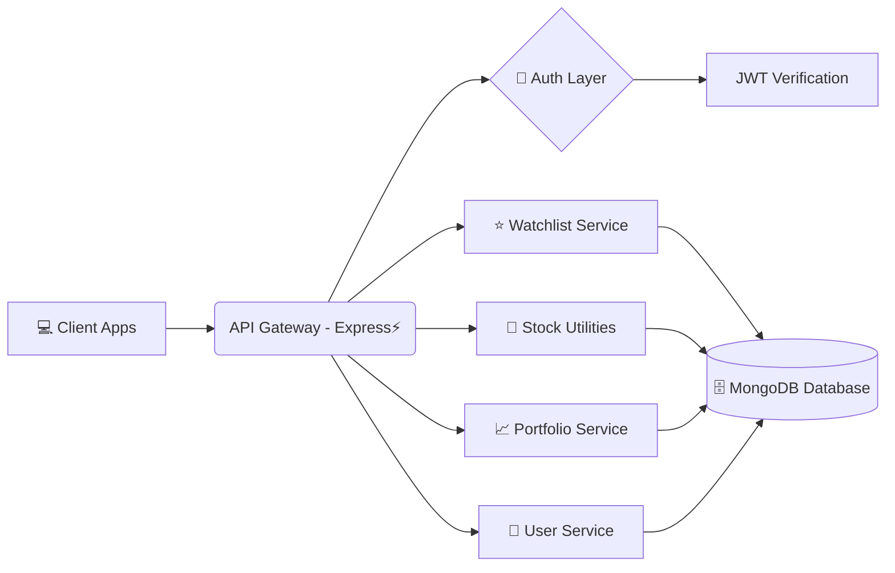

# 📊 StockSaga Backend

### ⚡ A Scalable Backend for Real-Time Stock Analytics & Portfolio Management

<div align="center">

[]()
[]()
[]()
[]()
[]()

<p align="center">
  <a href="#-project-overview">Overview</a> •
  <a href="#-key-features">Features</a> •
  <a href="#-architecture">Architecture</a> •
  <a href="#-installation--setup">Installation</a> •
  <a href="#-api-endpoints">API</a> •
  <a href="#-project-structure">Structure</a>
</p>

</div>

---

## 🧾 Project Overview

**StockSaga Backend** powers the StockSaga ecosystem — a platform for stock insights, portfolio management, watchlists, and real-time analytics.

This backend delivers:

⚡ Fast and secure REST APIs

🧱 Clean modular architecture

🔐 Authentication & authorization

🧮 Portfolio computation logic

🗃️ Scalable database structure

Built for deployment on **Render**, **Vercel**, **AWS**, **Docker**, and more.

---

## 🌟 Key Features

### 🔐 Authentication System

* 🔒 Secure Login/Signup with JWT
* 👤 Role-based Access (Admin/User)
* 🔑 Encrypted Passwords (bcrypt)

### 📈 Stock & Portfolio Engine

* ➕ Add/Remove Stocks
* 📊 Portfolio Tracking & Auto-Calculations
* ⭐ Watchlist Management
* ⏱️ Real-Time Stock Price Fetch Utilities (if integrated)

### ⚙️ Developer-Friendly

* 🧩 Modular Express Routes
* 🛠️ Clean Controller-Service Architecture
* 🚨 Global Error Handler
* 🔧 Environment-based configuration

### 🛡 Security Layer

* 🏰 JWT & Refresh Tokens
* 🛡 Helmet Middleware
* 🚫 Rate Limiting (optional)
* 🌐 CORS Protection

---

## 🏗 Architecture



---

## ⚙ Installation & Setup

### 1️⃣ Clone the Repository

```bash
git clone https://github.com/Maanas52130/stocksaga-backend.git
cd stocksaga-backend
```

### 2️⃣ Install Dependencies

```bash
npm install
```

### 3️⃣ Setup Environment Variables

Create a `.env` file:

```env
PORT=5000
MONGO_URI=your_mongodb_url
JWT_SECRET=your_jwt_secret
REFRESH_SECRET=your_refresh_secret
```

### 4️⃣ Start the Server

**Development Mode**

```bash
npm run dev
```

**Production Mode**

```bash
npm start
```

---

## 🚀 API Endpoints

### 👤 Auth APIs

| Method | Endpoint           | Description         |
| ------ | ------------------ | ------------------- |
| POST   | `/api/auth/signup` | 📝 Register user    |
| POST   | `/api/auth/login`  | 🔐 Login & get JWT  |
| GET    | `/api/auth/me`     | 👤 Get user details |

### 📈 Portfolio APIs

| Method | Endpoint                    | Description        |
| ------ | --------------------------- | ------------------ |
| GET    | `/api/portfolio/`           | 📂 Fetch portfolio |
| POST   | `/api/portfolio/add`        | ➕ Add stock        |
| DELETE | `/api/portfolio/remove/:id` | ❌ Remove stock     |

### ⭐ Watchlist APIs

| Method | Endpoint                    | Description      |
| ------ | --------------------------- | ---------------- |
| GET    | `/api/watchlist/`           | ⭐ View watchlist |
| POST   | `/api/watchlist/add`        | ➕ Add symbol     |
| DELETE | `/api/watchlist/remove/:id` | 🗑 Remove symbol |

---

## 📂 Project Structure

```text
stocksaga-backend/
├── src/
│   ├── config/            # ⚙️ Database config
│   ├── controllers/       # 🎯 Route controllers
│   ├── middleware/        # 🛡 Auth & error middleware
│   ├── models/            # 🗄 Mongoose schemas
│   ├── routes/            # 🚏 API routes
│   ├── utils/             # 🔧 Helper functions
│   └── server.js          # 🚀 App entry point
├── package.json
├── .env.example
└── README.md
```

---

## 🔮 Future Enhancements

* 🧠 AI-driven stock recommendations
* 📊 GraphQL API support
* 🧵 Background Jobs (BullMQ)
* ⚡ Redis Caching for Stock Prices
* 📡 WebSocket real-time updates
* 📱 Mobile-first API optimization

---

<div align="center">
Made with 💙 for StockSaga by Maanas
</div>

---
